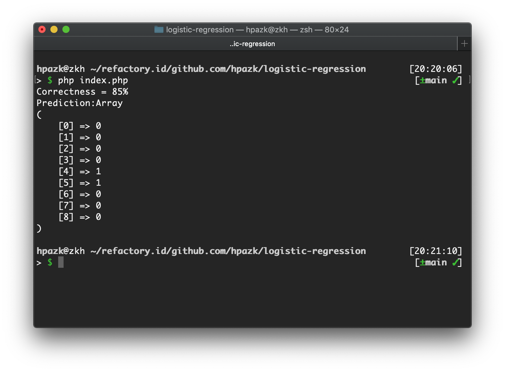

# Task 05 - Talent Factory Batch 1

## Logistic Regression

Regression adalah salah satu teknik pada machine learning yang mirip klasifikasi.

Logistic Regression merupakah salah satu teknik klasifikasi dengan menghitung probabilitas kelas dari sebuah sample. dan yang dimaksud logistik adalah fungsi yang membantu mendapatkan hubungan antara Kelas dengan variabel.

|Kelas1   |Kelas2   |
|---------|---------|
|variabel1|variabel1|
|variabel2|variabel2|

Fungsi logistik juga dikenal dengan fungsi sigmoid, yaitu mengubah probabilitas menjadi nilai biner.

Rumus sigmoid:
`f(x) = 1/(1+e^-(x)`

Sebagai contoh sebuah email memiliki probabilitas 78% merupakan spam maka email tersebut masuk ke dalam kelas spam. Dan jika sebuah email memiliki probabilitas <50% maka email tersebut diklasifikasikan kedalam email bukan spam.

### Probabilitas pada Logistic Regression

- Jika b0 + bX = 0, Maka P akan menjadi 0,5
- Jika b0 + bX > 0, Maka P akan menuju 1
- Jika b0 + bX < 0, Makan P akan menuju 0

Dimana:

- `b = koefisien`  
- `P = Probabilitas`

## Studi Kasus

Seseorang akan membeli setelah melihat iklan sebuah produk.

dataset diambil dari [Social Nework Ads](https://www.kaggle.com/dragonheir/logistic-regression)

Langkah-langkah:

1. Sesuaikan data csv secara manual

2. Convert csv ke dalam bentuk array

3. Instansisi Kelas objek

### Hasil

dimana:

- 1 = Kemungkinan akan membeli

- 0 = 'Kemungkinan tidak akan membeli
